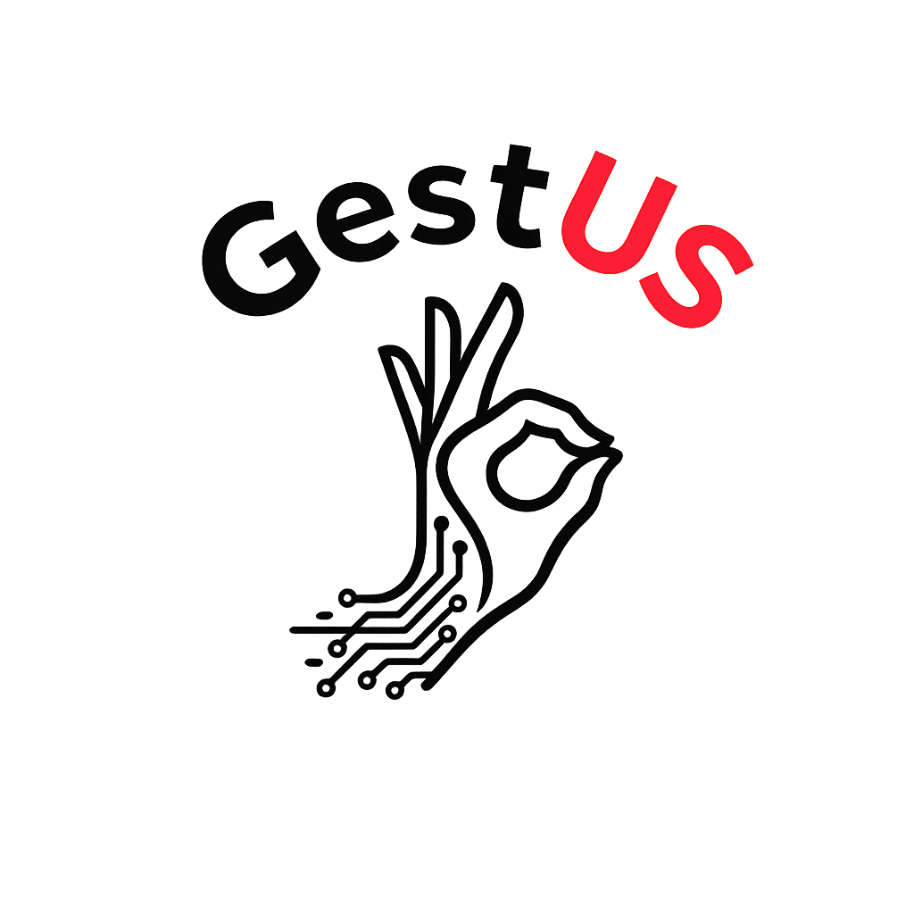

<p align="center">
  
</p>

<h1 align="center">GestUS</h1>

<p align="center">
  Guante sensorial para capturar la flexión de los dedos, reconocer gestos y visualizarlos en tiempo real mediante ESP32, Python e IA.
</p>

---

## Descripción

**GestUS** es un prototipo desarrollado para **Hack4Change** por el **Team Kbros**.

El proyecto consiste en un guante sensorial capaz de leer el movimiento de la mano mediante sensores de flexión caseros, un módulo MPU6050 y un ESP32.
Los datos capturados se procesan en Python para reconocer gestos y también pueden visualizarse en una interfaz web 3D.

El objetivo principal es reconocer letras o gestos concretos, con posibles aplicaciones futuras en accesibilidad, educación, rehabilitación o interfaces de control.

---

## Funcionamiento general

```text
Sensores de flexión + MPU6050
          ↓
        ESP32
          ↓
Filtrado y calibración
          ↓
Flexión 0-100 por dedo
          ↓
        Python
          ↓
IA / Visualización web
```

Cada dedo se transforma a una escala común:

```text
0   = dedo recto
100 = dedo completamente flexionado
```

---

## Hardware utilizado

* ESP32.
* 5 sensores de flexión caseros.
* MPU6050.
* Resistencias para divisores de tensión.
* Guante como soporte físico.
* Cables y conexiones.
* Ordenador para recibir y procesar los datos.

Los sensores caseros funcionan como resistencias variables.
Al doblarse, cambia su resistencia eléctrica y el ESP32 detecta esa variación como un valor analógico.

---

## Software utilizado

* Arduino IDE.
* Python.
* pandas.
* numpy.
* scikit-learn.
* pyserial.
* websockets.
* HTML, CSS y JavaScript.
* Three.js.

---

## Modos del proyecto

### Modo 1: Traducción de gestos

```text
Guante → ESP32 → Python → Modelo IA → Letra reconocida
```

Este modo utiliza los valores del guante para reconocer letras o gestos entrenados previamente.

El modelo recibe:

* Flexión del pulgar.
* Flexión del índice.
* Flexión del corazón.
* Flexión del anular.
* Flexión del meñique.
* Datos del acelerómetro y giroscopio del MPU6050.

Con estos datos, el sistema predice la letra o gesto correspondiente.

---

### Modo 2: Visualización web 3D

```text
ESP32
  ↓ Puerto serie
Python
  ↓ WebSocket / JSON
Navegador web
  ↓ Three.js
Mano 3D
```

Este modo permite visualizar en tiempo real la flexión de los dedos mediante una mano 3D interactiva.

Funcionamiento:

* El ESP32 envía los datos al PC mediante puerto serie.
* Python lee esos datos y actúa como servidor local.
* La web se conecta a Python mediante WebSocket.
* Los datos se envían en formato JSON.
* Three.js representa el movimiento de la mano en 3D.

---

## Calibración de sensores

Como los sensores son caseros, las lecturas pueden variar según el montaje, la presión o el movimiento.
Por eso se aplica una calibración para convertir cada lectura en un valor estable entre 0 y 100.

El código incluye:

* Filtro de mediana para eliminar picos.
* Media móvil para suavizar la señal.
* Zona muerta para ignorar pequeñas variaciones en reposo.
* Rangos calibrados por dedo.
* Conversión final a flexión entre 0 y 100.

Esto permite que todos los dedos se interpreten en una misma escala, aunque cada sensor tenga valores eléctricos distintos.

---

## Dataset

El dataset se genera a partir de las lecturas del guante.

Cada fila contiene:

```text
Pulgar, Índice, Corazón, Anular, Meñique, AX, AY, AZ, GX, GY, GZ, Letra
```

Donde:

* `Pulgar` a `Meñique`: valores de flexión entre 0 y 100.
* `AX`, `AY`, `AZ`: acelerómetro.
* `GX`, `GY`, `GZ`: giroscopio.
* `Letra`: etiqueta asociada al gesto realizado.

Estos datos se utilizan para entrenar y probar el modelo de reconocimiento.

---

## Estructura del repositorio

```text
hack4change-TeamKbros/
│
├── GUANTEV2/
│   └── Código del ESP32
│
├── GestUS/
│   ├── gestus_launcher.py
│   ├── modo1_traduccion/
│   └── modo2_web_visualizacion/
│
├── RecogerDatos/
│   └── Scripts y datasets para capturar datos
│
├── assets/
│   └── logo_gestus.png
│
├── requirements.txt
├── .gitignore
└── README.md
```

---

## Instalación

El proyecto utiliza un entorno virtual de Python para mantener las versiones de librerías necesarias para que el modelo de IA funcione correctamente.

Se recomienda instalar las dependencias desde `requirements.txt`.

### 1. Clonar el repositorio

```bash
git clone https://github.com/rfreyes4/hack4change-TeamKbros.git
cd hack4change-TeamKbros
```

### 2. Crear un entorno virtual

En Linux:

```bash
python3 -m venv .venv
source .venv/bin/activate
```

En Windows:

```bash
python -m venv .venv
.venv\Scripts\activate
```

Cuando el entorno esté activado, la terminal mostrará algo parecido a:

```bash
(.venv) usuario@pc:~/hack4change-TeamKbros$
```

### 3. Instalar dependencias

```bash
python -m pip install --upgrade pip
pip install -r requirements.txt
```

El archivo `requirements.txt` fija las versiones usadas durante el desarrollo para evitar problemas de compatibilidad con el modelo entrenado.

---

## Uso

### 1. Cargar el código en el ESP32

Abrir en Arduino IDE el código de la carpeta:

```text
GUANTEV2/
```

Seleccionar la placa ESP32, elegir el puerto correspondiente y subir el programa.

### 2. Ejecutar GestUS

Con el entorno virtual activado, ejecutar desde la carpeta principal:

```bash
cd GestUS
python3 gestus_launcher.py
```

En Windows:

```bash
cd GestUS
python gestus_launcher.py
```

El lanzador permite seleccionar entre los modos disponibles:

```text
Modo 1: Traducción de gestos
Modo 2: Visualización web
```

---

## Activar el entorno en futuras ejecuciones

Cada vez que se abra una nueva terminal, hay que volver a activar el entorno virtual.

En Linux:

```bash
cd hack4change-TeamKbros
source .venv/bin/activate
cd GestUS
python3 gestus_launcher.py
```

En Windows:

```bash
cd hack4change-TeamKbros
.venv\Scripts\activate
cd GestUS
python gestus_launcher.py
```

---

## Comunicación actual

Actualmente el cable USB cumple dos funciones:

* Alimentar el ESP32.
* Enviar los datos al ordenador mediante puerto serie.

Flujo actual:

```text
ESP32 + guante
      ↓ USB / Puerto serie
Python en PC
      ↓ WebSocket
IA / Web 3D
```

---

## Versión futura sin cables

Una mejora futura sería hacer el guante inalámbrico.

En ese caso:

* El ESP32 se alimentaría con batería o power bank.
* Los datos se enviarían por WiFi.
* El PC recibiría los datos por red.
* El resto del sistema seguiría igual.

```text
ESP32 + batería
      ↓ WiFi
Python en PC
      ↓ WebSocket
IA / Web 3D
```

Solo se sustituiría la comunicación por puerto serie por una comunicación inalámbrica.

---

## Estado actual

* Lectura de 5 sensores de flexión.
* Lectura del MPU6050.
* Calibración de datos a escala 0-100.
* Envío de datos por puerto serie.
* Captura de datos en CSV.
* Reconocimiento de gestos mediante IA.
* Visualización web 3D en tiempo real.

---

## Mejoras futuras

* Aumentar el número de letras y gestos reconocidos.
* Mejorar el dataset con más muestras.
* Hacer el guante inalámbrico.
* Añadir alimentación mediante batería.
* Mejorar la comodidad del montaje.
* Mejorar la precisión del modelo.
* Aplicarlo a accesibilidad, educación o rehabilitación.

---

## Nota

Este proyecto es un prototipo académico y experimental.
No pretende sustituir un sistema profesional de traducción de lengua de signos, sino demostrar una posible solución técnica basada en sensores, procesamiento de datos e inteligencia artificial.

---

## Equipo

Proyecto desarrollado por **Team Kbros** para **Hack4Change**.

